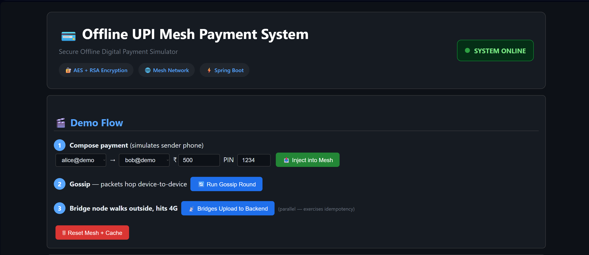
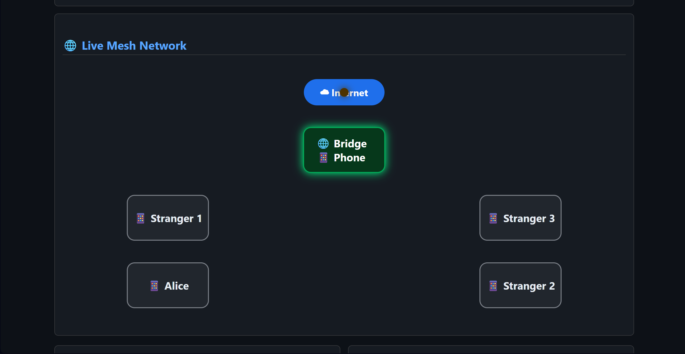
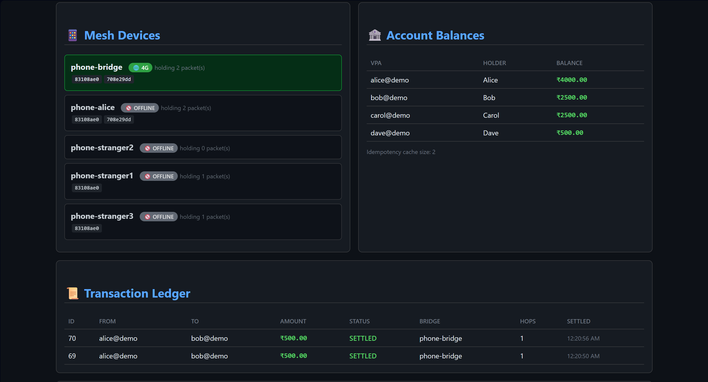
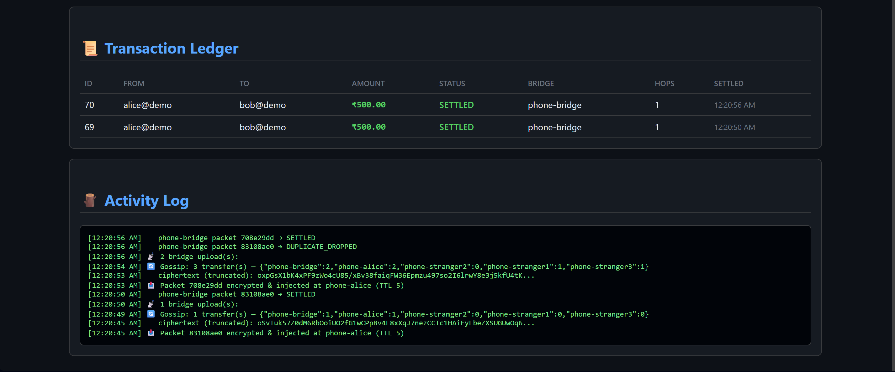

````markdown
# 🔐 Offline UPI Mesh Payment System

> A Spring Boot prototype that simulates **offline payment creation, encrypted store-and-forward mesh routing, bridge-based delivery, duplicate protection, and transactional settlement**.

**Repository:** Mahak-Sahu/offline-upi-mesh-payment-system

---

## 📌 Overview

This project explores a simple question:

> **How can a payment instruction survive temporary loss of internet connectivity and later reach a backend safely for settlement?**

The project simulates an offline payment environment using virtual devices.

A sender creates a payment while offline. The payment is encrypted into a `MeshPacket`, forwarded through simulated device-to-device mesh hops, reaches an internet-connected bridge device, and is then uploaded to the Spring Boot backend.

The backend:

1. hashes the encrypted packet,
2. checks idempotency,
3. decrypts the payment,
4. validates freshness,
5. performs transactional settlement,
6. records the transaction in MySQL.

### Important Scope

This is **not a real UPI implementation**.

It does not connect to:

- NPCI
- real banks
- real UPI infrastructure
- real Bluetooth/BLE hardware
- real customer accounts

The mesh and phones are simulated in software so the complete architecture can be demonstrated locally.

---

# 🚀 End-to-End Architecture

```text
                 OFFLINE SIDE
                      │
                      ▼
             ┌─────────────────┐
             │  Sender Device  │
             │ Create Payment  │
             └────────┬────────┘
                      │
                      ▼
             ┌─────────────────┐
             │ Hybrid Encrypt  │
             │ RSA + AES-GCM   │
             └────────┬────────┘
                      │
                      ▼
             ┌─────────────────┐
             │   MeshPacket    │
             │  Store/Forward  │
             └────────┬────────┘
                      │
                One hop at a time
                      │
          ┌───────────┴───────────┐
          ▼                       ▼
   Stranger Device          Stranger Device
          │                       │
          └───────────┬───────────┘
                      ▼
             ┌─────────────────┐
             │  Bridge Device  │
             │   Has Internet  │
             └────────┬────────┘
                      │
                      ▼
             ┌─────────────────┐
             │ Spring Boot API │
             └────────┬────────┘
                      │
              Hash / Idempotency
                      │
                   Decrypt
                      │
             Freshness Validation
                      │
                 Settlement
                      │
                      ▼
                   MySQL
````

---

# ✨ Implemented Features

## 🔐 1. Hybrid Encryption

Every payment instruction is encrypted before entering the simulated mesh.

Implemented:

* AES-256-GCM for payment payload encryption
* RSA-2048 OAEP with SHA-256 for AES-key encryption
* Fresh AES key for every packet
* Random 12-byte GCM IV
* AES-GCM authentication tag

The encrypted packet contains:

```text
[ RSA-encrypted AES key ]
          +
[ GCM IV ]
          +
[ AES-GCM ciphertext + authentication tag ]
```

Flow:

```text
PaymentInstruction
      ↓
JSON serialization
      ↓
Random AES-256 key
      ↓
AES-256-GCM encryption
      ↓
RSA-OAEP encrypts AES key
      ↓
MeshPacket
```

Intermediate mesh devices only carry the encrypted packet and do not receive the plaintext payment instruction.

---

# 📦 2. MeshPacket

The payment travels through the simulated network as a `MeshPacket`.

Conceptually:

```text
MeshPacket
├── packetId
├── ttl
├── createdAt
└── ciphertext
```

The encrypted payment instruction contains fields such as:

```text
PaymentInstruction
├── senderVpa
├── receiverVpa
├── amount
├── pinHash
├── nonce
└── signedAt
```

The payment instruction is encrypted before being placed inside the mesh packet.

---

# 📡 3. Simulated Store-and-Forward Mesh

The project does **not** use real Bluetooth or BLE.

The mesh is simulated using:

* `MeshSimulatorService`
* `VirtualDevice`
* in-memory packet state

Current virtual devices:

```text
phone-alice
phone-stranger1
phone-stranger2
phone-stranger3
phone-bridge
```

The current routing implementation performs **one hop per gossip request**.

A packet is intentionally not allowed to jump directly from Alice to the bridge.

Example:

```text
Alice
  │
  ▼
Stranger 2
  │
  ▼
Stranger 1
  │
  ▼
Bridge
```

The exact stranger selected can vary because eligible devices are selected by the simulator.

### Routing behavior

The simulator currently:

* performs one forwarding hop per gossip call
* tracks visited devices
* avoids revisiting devices
* decreases TTL on forwarding
* records route information
* records hop information
* prevents direct sender-to-bridge routing before the required stranger hops
* stops when the bridge is reached or no further hop is available

---

# ⏳ 4. TTL / Hop Limit

Packets are created with a TTL.

The demo currently uses:

```text
TTL = 5
```

Each forwarding hop decreases the TTL.

Conceptually:

```text
Alice
TTL 5
  │
  ▼
Stranger
TTL 4
  │
  ▼
Stranger
TTL 3
  │
  ▼
Bridge
TTL 2
```

TTL limits how far a packet can propagate through the simulated mesh.

---

# 🌐 5. Bridge Device

The bridge is a simulated device marked as having internet connectivity.

The bridge does **not** decrypt the payment.

Its responsibility is to deliver the encrypted packet to the backend.

```text
Encrypted MeshPacket
        │
        ▼
   Bridge Device
        │
        ▼
 Spring Boot Backend
        │
        ▼
Hash
        │
        ▼
Idempotency
        │
        ▼
Decrypt
        │
        ▼
Freshness
        │
        ▼
Settlement
```

---

# ♻️ 6. Duplicate / Idempotent Processing

The same offline packet can reach the backend more than once.

For example:

```text
Bridge A ──┐
Bridge B ──┼──► Same Packet ──► Backend
Bridge C ──┘
```

The backend calculates a SHA-256 hash of the encrypted ciphertext.

That hash is used as the idempotency key.

Expected behavior:

```text
First delivery
      ↓
SETTLED

Repeated delivery
      ↓
DUPLICATE_DROPPED
```

The transaction table also has a unique constraint on `packetHash`, providing an additional database-level protection against duplicate transaction records.

### Current limitation

The idempotency cache is currently **in-memory**.

It is suitable for this single-instance prototype and is covered by a concurrency test.

A production multi-instance deployment would need shared idempotency state such as Redis or a database-backed mechanism.

---

# 🛡️ 7. Tamper Detection

AES-GCM provides authenticated encryption.

If an attacker modifies the encrypted payload:

```text
Modified ciphertext
        ↓
AES-GCM authentication fails
        ↓
Decryption fails
        ↓
INVALID
        ↓
No settlement
```

This behavior is covered by an automated test.

Intermediate mesh devices therefore only transport encrypted data.

---

# ⏱️ 8. Freshness / Replay-Related Protection

Each `PaymentInstruction` contains:

```text
nonce
signedAt
```

The backend validates `signedAt` against the configured maximum packet age.

Default:

```text
86400 seconds
= 24 hours
```

Packets older than the configured freshness window are rejected.

Packets significantly ahead of the server clock are also rejected.

The nonce uniquely identifies a payment intent, while the ciphertext hash is used for duplicate-delivery detection.

> This is a prototype freshness and idempotency mechanism. It is not a complete production offline replay-prevention protocol.

---

# 💾 9. Transactional Settlement

`SettlementService` performs the actual ledger update inside a database transaction.

The successful flow is:

```text
Load sender
    ↓
Load receiver
    ↓
Validate amount
    ↓
Check balance
    ↓
Debit sender
    ↓
Credit receiver
    ↓
Record transaction
```

The sender and receiver updates happen inside the same transactional boundary.

If the sender does not have sufficient balance:

```text
Payment
   ↓
Insufficient Balance
   ↓
REJECTED
```

No debit/credit transfer is performed.

---

# 🔐 10. Optimistic Locking

The `Account` entity uses JPA optimistic locking through an `@Version` field.

This prevents concurrent updates from silently overwriting each other's balances.

Conceptually:

```text
Payment A ──┐
            ├── Account
Payment B ──┘
                │
          ┌─────┴─────┐
          ▼           ▼
       Success     Conflict
                      │
                      ▼
               RETRY_REQUIRED
```

The ingestion layer converts optimistic locking conflicts into a retry response instead of silently losing an update.

---

# 👥 11. Browser Session Isolation

Demo accounts and transactions are isolated by browser session.

Conceptually:

```text
Browser A
 ├── Alice
 ├── Bob
 └── Transactions

Browser B
 ├── Alice
 ├── Bob
 └── Transactions
```

Accounts are identified using:

```text
sessionId + VPA
```

Transactions also contain the session ID.

The reset operation removes only transactions belonging to the current session rather than clearing the complete transaction table.

---

# 🧹 12. Payment UI State Management

The dashboard uses a simple payment state machine to prevent multiple active payment flows from interfering with each other.

```text
IDLE
 │
 │ Inject
 ▼
INJECTED
 │
 │ Start Gossip
 ▼
GOSSIPING
 │
 │ Bridge reached
 ▼
READY_FOR_UPLOAD
 │
 │ Upload
 ▼
IDLE
```

During gossip:

```text
Inject       🔒
Gossip       🔒
Upload       🔒
Reset        ✅
```

After bridge reach:

```text
Inject       🔒
Gossip       🔒
Upload       ✅
Reset        ✅
```

After successful processing:

```text
Packet cleared
      ↓
State → IDLE
      ↓
Next payment ready
```

This prevents a second injection from disturbing the packet currently being propagated.

---

# 🔢 PIN / Authentication Scope

The current prototype **does not implement real UPI PIN verification**.

During demo payment creation:

```text
Entered PIN
    ↓
SHA-256
    ↓
pinHash
    ↓
Encrypted inside PaymentInstruction
```

The backend currently does **not** compare that value against a stored bank-side PIN credential.

Therefore this project does **not** claim to implement production-grade UPI PIN authentication.

This limitation is intentionally documented rather than presenting the prototype as a real UPI authentication system.

---

# 🧪 Testing

The project includes automated tests for important cryptographic and distributed-processing behavior.

## Encryption / Decryption

Verifies the hybrid encryption round trip.

```text
PaymentInstruction
      ↓
Encrypt
      ↓
Ciphertext
      ↓
Decrypt
      ↓
PaymentInstruction
```

## Tampered Ciphertext

The test modifies the encrypted ciphertext.

Expected result:

```text
INVALID
```

The payment must not settle.

## Concurrent Duplicate Delivery

Three concurrent bridge deliveries submit the same packet.

Expected result:

```text
3 concurrent deliveries
        │
        ▼
    Backend
        │
   ┌────┼────┐
   ▼    ▼    ▼
 SETTLED DUP DUP
```

Specifically:

```text
1 × SETTLED
2 × DUPLICATE_DROPPED
```

The test also verifies that the sender balance changes only once.

Run:

```bash
mvn test
```

---

# 🖥️ Dashboard

The dashboard provides a visual demonstration of:

* payment creation
* mesh devices
* packet ownership
* packet movement
* bridge connectivity
* account balances
* transaction history
* idempotency cache size
* activity log
* settlement results

Typical demo flow:

```text
Reset
 ↓
Inject Payment
 ↓
Start Gossip
 ↓
Watch packet move through mesh
 ↓
Bridge reached
 ↓
Upload to Backend
 ↓
Backend validation
 ↓
Settlement
 ↓
Transaction appears in ledger
```
## 📸 Project Screenshots

### 🖥️ Dashboard

The main dashboard provides an overview of the simulated payment system, accounts, mesh devices, transaction history, and payment controls.



### 📡 Live Mesh Routing

The mesh visualization shows the encrypted payment packet moving one hop at a time through virtual devices until it reaches the bridge.



### 🌐 Mesh Devices

The dashboard displays the available virtual devices participating in the simulated mesh network.



### 📝 Activity Log

The activity log shows the step-by-step lifecycle of packet injection, mesh forwarding, bridge arrival, backend processing, and settlement.


---

# 🔌 API Endpoints

| Method | Endpoint             | Purpose                                        |
| ------ | -------------------- | ---------------------------------------------- |
| `GET`  | `/`                  | Dashboard                                      |
| `GET`  | `/api/server-key`    | Get server public key                          |
| `GET`  | `/api/accounts`      | Get current session accounts                   |
| `GET`  | `/api/transactions`  | Get current session transactions               |
| `GET`  | `/api/mesh/state`    | Get current mesh state                         |
| `POST` | `/api/demo/send`     | Create, encrypt and inject a demo payment      |
| `POST` | `/api/mesh/gossip`   | Perform one mesh forwarding hop                |
| `POST` | `/api/mesh/flush`    | Upload bridge-held packets                     |
| `POST` | `/api/bridge/ingest` | Process an uploaded encrypted packet           |
| `POST` | `/api/demo/reset`    | Reset current session demo data and mesh state |

---

# 🏗️ Project Structure

```text
src/
├── main/
│   ├── java/com/demo/upimesh/
│   │   ├── config/
│   │   │   └── AppConfig.java
│   │   │
│   │   ├── controller/
│   │   │   ├── ApiController.java
│   │   │   └── DashboardController.java
│   │   │
│   │   ├── crypto/
│   │   │   ├── HybridCryptoService.java
│   │   │   └── ServerKeyHolder.java
│   │   │
│   │   ├── model/
│   │   │   ├── Account.java
│   │   │   ├── AccountRepository.java
│   │   │   ├── Hop.java
│   │   │   ├── MeshPacket.java
│   │   │   ├── PaymentInstruction.java
│   │   │   ├── Transaction.java
│   │   │   └── TransactionRepository.java
│   │   │
│   │   ├── service/
│   │   │   ├── BridgeIngestionService.java
│   │   │   ├── DemoService.java
│   │   │   ├── IdempotencyService.java
│   │   │   ├── MeshSimulatorService.java
│   │   │   ├── SettlementService.java
│   │   │   └── VirtualDevice.java
│   │   │
│   │   └── UpiMeshApplication.java
│   │
│   └── resources/
│       ├── static/
│       │   ├── css/
│       │   │   └── dashboard.css
│       │   ├── images/
│       │   └── js/
│       │       └── dashboard.js
│       │
│       ├── templates/
│       │   └── dashboard.html
│       │
│       ├── application-local.properties
│       └── application.properties
│
├── test/
│   └── java/com/demo/upimesh/
│       └── IdempotencyConcurrencyTest.java
│
├── docs/
│   ├── diagrams/
│   │   ├── payment-flow.md
│   │   └── system-architecture.md
│   ├── gifs/
│   └── images/
│       ├── activity-log.png
│       ├── dashboard.png
│       ├── live-mesh.png
│       └── mesh-devices.png
│
├── .env
├── .gitignore
├── mvnw
├── mvnw.cmd
├── pom.xml
└── README.md
```

---

# 🧰 Technology Stack

| Layer           | Technology                          |
| --------------- | ----------------------------------- |
| Language        | Java 17                             |
| Backend         | Spring Boot 3.3.5                   |
| REST            | Spring Web                          |
| ORM             | Spring Data JPA / Hibernate         |
| Database        | MySQL                               |
| Encryption      | AES-256-GCM                         |
| Key Encryption  | RSA-2048 OAEP + SHA-256             |
| Hashing         | SHA-256                             |
| Frontend        | HTML, CSS, JavaScript               |
| Template Engine | Thymeleaf                           |
| Build Tool      | Maven                               |
| Testing         | JUnit / Spring Boot Test            |
| Mesh            | In-memory virtual device simulation |

---

# 🚀 Getting Started

## Prerequisites

* Java 17+
* Maven 3.9+
* MySQL 8+
* Git

## 1. Clone the Repository

```bash
git clone https://github.com/Mahak-Sahu/offline-upi-mesh-payment-system.git
cd offline-upi-mesh-payment-system
```

## 2. Create the MySQL Database

```sql
CREATE DATABASE offline_upi;
```

## 3. Configure Database Credentials

Set the environment variables used by the application:

```text
DB_USERNAME=your_mysql_username
DB_PASSWORD=your_mysql_password
```

Never commit real database credentials.

## 4. Run the Application

```bash
mvn spring-boot:run
```

Or:

```bash
mvn -DskipTests package
java -jar target/*.jar
```

## 5. Open the Dashboard

```text
http://localhost:8080
```

---

# 🧪 Run Tests

```bash
mvn test
```

The test suite includes encryption/decryption, tampered ciphertext handling, and concurrent duplicate-delivery testing.

---

# ⚠️ What This Project Does NOT Implement

This section is intentionally explicit so the repository does not overclaim production capabilities.

### ❌ Real UPI integration

No connection to:

* NPCI
* banks
* real UPI switches
* production UPI APIs

### ❌ Real Bluetooth/BLE mesh

The phones are software objects represented by `VirtualDevice`.

No physical Bluetooth, BLE, Wi-Fi Direct, or Android device-to-device communication is implemented.

### ❌ Production bridge authentication

The bridge ingestion endpoint is a prototype API.

Production would require mechanisms such as:

* mutual TLS
* bridge certificates
* device identity
* authorization
* rate limiting

### ❌ Sender digital signatures

The current payment instruction uses encryption and authenticated encryption, but does not implement a sender-side digital signature scheme for independently proving sender identity.

### ❌ Real UPI PIN verification

The current prototype carries a SHA-256-derived `pinHash` inside the encrypted instruction, but does not compare it against a stored bank-side credential.

### ❌ Offline proof of funds

The sender's actual account balance is checked when the packet reaches the backend.

There is no hardware-backed offline wallet or pre-funded balance reservation.

### ❌ Complete offline double-spend prevention

A sender can create multiple payment packets while offline.

The backend can settle one first and reject another if funds are no longer available, but this prototype does not implement an offline wallet protocol that prevents this scenario before connectivity is restored.

### ❌ Distributed idempotency

The current idempotency cache is in-memory and designed for the single-instance demo.

### ❌ Production key management

The server key lifecycle is not equivalent to a banking HSM/KMS deployment.

### ❌ Production compliance

This project does not implement banking-grade KYC, fraud monitoring, regulatory controls, audit infrastructure, or financial compliance.

---

# 🧠 Why This Project Is Still Valuable

The goal is not to pretend that this is a production UPI implementation.

The project demonstrates real backend engineering concepts:

```text
Connectivity Loss
       ↓
Store-and-Forward Delivery
       ↓
Encrypted Message
       ↓
Duplicate Delivery
       ↓
Idempotent Processing
       ↓
Concurrent Database Updates
       ↓
Atomic Settlement
       ↓
Persistent Transaction Ledger
```

Key concepts demonstrated:

* distributed-system thinking
* store-and-forward architecture
* authenticated encryption
* idempotent processing
* optimistic concurrency control
* database transactions
* session isolation
* failure-aware API design
* automated concurrency testing

---

# 🎯 Example Demo

Example:

```text
Alice sends ₹100 to Bob
        │
        ▼
PaymentInstruction created
        │
        ▼
AES-256-GCM encryption
        │
        ▼
RSA-OAEP encrypted AES key
        │
        ▼
MeshPacket injected
        │
        ▼
phone-alice
        │
        ▼
phone-stranger2
        │
        ▼
phone-stranger1
        │
        ▼
phone-bridge
        │
        ▼
Backend ingestion
        │
        ├── SHA-256 hash
        ├── Idempotency check
        ├── Decryption
        ├── Freshness validation
        └── Settlement
        │
        ▼
SETTLED
        │
        ├── Alice: -₹100
        └── Bob:   +₹100
```

The resulting transaction appears in the dashboard ledger.

---

# ⚠️ Important Architectural Limitation

The most accurate description of this project is:

> **Mesh-routed deferred payment settlement**

rather than:

> **Real-time offline UPI**

The sender can create and transport an encrypted payment instruction without internet, but the actual account settlement happens only when the packet reaches the backend.

This project therefore demonstrates the **architecture and backend reliability challenges around offline payment delivery**, rather than implementing the real UPI network.

---

# 🔮 Future Improvements

Possible future work:

* Real Android BLE / Wi-Fi Direct communication
* Persistent encrypted offline packet storage
* Bridge device certificates
* Mutual TLS
* Sender digital signatures
* Redis-backed distributed idempotency
* Production HSM/KMS key management
* Offline pre-funded wallet / balance reservation
* Real bank/NPCI integration
* Rate limiting and fraud detection
* Observability and metrics
* Containerized/cloud deployment
* Larger network and failure simulations

---

# 📌 Resume Description

> **Offline UPI Mesh Payment System** — Built a Spring Boot prototype for mesh-routed deferred payment settlement using RSA-OAEP + AES-256-GCM encryption, store-and-forward routing, SHA-256 idempotency, transactional debit/credit settlement, optimistic locking, browser-session isolation, and concurrent duplicate-delivery testing.

---

# 👨‍💻 Author

**Mahak Sahu**

B.Tech — Artificial Intelligence & Data Science

Repository: `Mahak-Sahu/offline-upi-mesh-payment-system`

---

# 📜 License

This project is intended for **educational, research, and portfolio demonstration purposes**.

It is not a production payment system and must not be used to process real financial transactions.

---

<p align="center">
  Built with Java, Spring Boot, MySQL, cryptography, distributed-systems concepts, and offline-first architecture.
</p>
```