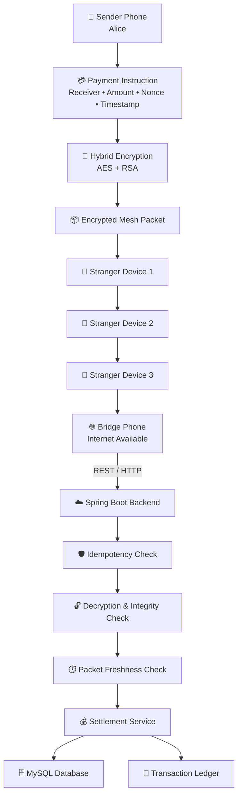

# System Architecture

The Offline UPI Mesh Payment System simulates how a digital payment can move through a disconnected device network and eventually reach an internet-connected bridge device for backend settlement.

## High-Level Architecture



## Architecture Components

### 1. Sender Phone

The sender creates a payment instruction containing the payment information such as:

- Sender
- Receiver
- Amount
- Nonce
- Timestamp

The payment is then converted into an encrypted mesh packet.

### 2. Encryption Layer

The payment payload is protected before it enters the mesh.

The system uses a hybrid encryption approach:

- AES for payment payload encryption
- RSA for protecting the AES key
- Authentication mechanisms to detect packet modification

The intermediate devices therefore operate on encrypted payment packets rather than plaintext payment information.

### 3. Mesh Devices

The mesh contains multiple virtual devices.

A packet can move from one device to another through gossip-style propagation.

```text
Sender
   ↓
Device 1
   ↓
Device 2
   ↓
Device 3
   ↓
Bridge
```

The devices do not need a direct internet connection.

### 4. Bridge Phone

The bridge represents a device that temporarily participates in the offline mesh and later obtains internet connectivity.

Once connected, it uploads the packets it has collected to the backend.

### 5. Spring Boot Backend

The backend receives packets from the bridge and performs the validation and settlement pipeline.

The major processing stages are:

```text
Receive Packet
      ↓
Idempotency Check
      ↓
Decrypt
      ↓
Integrity Validation
      ↓
Freshness Validation
      ↓
Settlement
      ↓
Database + Transaction Ledger
```

### 6. Idempotency Layer

The same encrypted packet can potentially reach the backend multiple times because of mesh propagation and multiple bridge uploads.

The idempotency layer prevents the same payment packet from being settled more than once.

```text
Packet A
   ↓
Backend
   ↓
Already processed?
   ├── YES → DUPLICATE_DROPPED
   │
   └── NO → Continue processing
```

### 7. Settlement Service

After validation, the settlement service applies the simulated payment.

The system updates:

- Sender balance
- Receiver balance
- Transaction status
- Settlement information
- Transaction ledger

### 8. MySQL Database

MySQL stores the persistent application state, including account and transaction information.

---

## End-to-End Flow

```text
┌────────────────┐
│  Sender Phone  │
└───────┬────────┘
        │
        ▼
┌────────────────────┐
│ Payment Instruction│
└────────┬───────────┘
         │
         ▼
┌────────────────────┐
│ Hybrid Encryption  │
└────────┬───────────┘
         │
         ▼
┌────────────────────┐
│ Encrypted Packet   │
└────────┬───────────┘
         │
         ▼
┌────────────────────┐
│ Offline Mesh       │
│ Device-to-Device   │
└────────┬───────────┘
         │
         ▼
┌────────────────────┐
│   Bridge Phone     │
│ Internet Available │
└────────┬───────────┘
         │
         ▼
┌────────────────────┐
│ Spring Boot API    │
└────────┬───────────┘
         │
         ▼
┌────────────────────┐
│ Idempotency Check  │
└────────┬───────────┘
         │
         ▼
┌────────────────────┐
│ Decrypt + Validate │
└────────┬───────────┘
         │
         ▼
┌────────────────────┐
│ Settlement Service │
└────────┬───────────┘
         │
         ├──────────────► MySQL
         │
         └──────────────► Transaction Ledger
```

---

## Design Goal

The architecture demonstrates a **store-and-forward payment model** where payment information can be transported through an offline mesh before eventually reaching an internet-connected bridge for backend processing.

The project is a **simulation / proof-of-concept**, not a production UPI implementation.